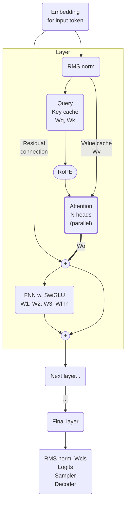

# llama2-rs

This is a rewrite of [llama2.c][llama2_c] to Rust and Apple M2 Metal GPU, with
a bit of [Rayon][rayon]. This code is just for learning purposes, it is not
maintained. Below are the learnings.

## Prerequisites

You need `tokenizer.bin` from the original llama2.c repo, also you need the
[TinyStories][TinyStories] model, or a full llama2 7B model. See
[llama2.c][llama2_c] on how to download and convert the model.

[rayon]: https://github.com/rayon-rs/rayon
[TinyStories]: https://huggingface.co/datasets/roneneldan/TinyStories
[llama2_c]: https://github.com/karpathy/llama2.c


# Diagrams

Here are some diagrams that I draw along the implementation to understand what
the code actually does. Those diagrams later helped me to figure which matrix
multiplications can be run independently.


## High level



##  Detailed

The detailed flow diagram based directly on the code:

```mermaid
flowchart TD

embedding("embedding <br/> [seq_len x dim] <br/> (tok)")
embedding --> x_1
x_1("x <br/> [dim]")

%% subgraph For each layer

rmsnorm_1(("RMSNorm <br/> [dim]"))
rms_att_weight("RMS att. weight <br/> [L x dim] <br/> (layer)")
xb_1("xb <br/> [dim]")

%% This is for every layer    


x_1 -->rmsnorm_1
rms_att_weight --> rmsnorm_1
rmsnorm_1 --> xb_1

w_q("Wq <br/> [L x dim x dim] <br/> (layer)")
query("query <br/> [dim]")
w_q --> matmul_q(("@"))
xb_1 ---> matmul_q
matmul_q --> query

key("key cache <br/> [L x seq_len x kv_dim] (layer, pos)")
w_k("Wk <br/> [L x dim x kv_dim] <br/> (layer)")
w_k --> matmul_k(("@"))
xb_1 ---> matmul_k
matmul_k --> key

w_v("Wv <br/> [L x dim x kv_dim] <br/> (layer)")
value("value cache <br/> [L x seq_len x kv_dim] <br/> (layer, pos)
")
w_v --> matmul_v(("@"))
xb_1 ---> matmul_v
matmul_v --> value

rope_q(["RoPE (pos)"])
query --> rope_q

rope_k(["RoPE (pos)"])
key --> rope_k

%% This is for every attention head
rope_q --[n_heads x head_size] (head)--> att_q
rope_k --[???]--> att_k
value --[???]--> att_v
subgraph Each attention head
    att_q("query slice") --> att_dot_1
    att_k("key slice") --> att_dot_1
    att_dot_1(["dot"]) --> att
    att("attention scores") --> att_softmax
    att_softmax(["softmax"])
    att_v("value slice")
    att_softmax-->att_dot_2
    att_v-->att_dot_2
    att_dot_2(["dot"]) --> att_xb
    att_xb["xb <br/> [dim]"]
end

att_xb-->matmul_xb2(("@"))
w_o("Wo </br> [L x dim x dim] </br> (layer)")-->matmul_xb2
matmul_xb2-->xb2
xb2("xb2 <br/> [dim]")-->add_x_xb2
x_1-->add_x_xb2
x_2("x' <br/> [dim]")
add_x_xb2(("+"))-->x_2

fnn_rmsnorm(("RMSNorm <br/> [dim]"))
rms_fnn_w("Wfnn <br/> [L x dim] <br/> (layer)")-->fnn_rmsnorm
x_2-->fnn_rmsnorm
xb_2("xb' <br/> [dim]")
fnn_rmsnorm-->xb_2
xb_2-->fnn_matmul_hb
xb_2-->fnn_matmul_hb2

subgraph FNN with SwiGLU
    fnn_matmul_hb(("@"))
    fnn_hb("hb <br/> [hidden_dim]")
    w1("W1 <br/> [L x dim x hidden_dim] <br/> (layer)")
    
    w1 --> fnn_matmul_hb
    fnn_matmul_hb-->fnn_hb

    fnn_matmul_hb2(("@"))
    fnn_hb2("hb2 <br/> [hidden_dim]")
    w3("W3 <br/> [L x dim x hidden_dim] <br/> (layer)")
    
    w3 --> fnn_matmul_hb2
    fnn_matmul_hb2-->fnn_hb2

    fnn_hb_2("hb' <br> [hidden_dim]")
    swiglu_hb((SwiGLU))
    fnn_hb --> swiglu_hb
    fnn_hb2 --> swiglu_hb
    swiglu_hb --> fnn_hb_2
    fnn_hb_2
end 

xb_3("xb'' <br> [dim]")
w2("W2 <br> [L x dim x hidden_dim] <br> (layer)")
fnn_matmul_final(("@"))
w2 --> fnn_matmul_final
fnn_hb_2 --> fnn_matmul_final
fnn_matmul_final-->xb_3

x_2 --> add_x_xb_3
xb_3 --> add_x_xb_3
x_3("x'' <br> [dim]")
add_x_xb_3(("+"))
add_x_xb_3 --> x_3

x_3 == "LOOP FOR EACH LAYER <br> x'' is x in next iteration" ==> x_1

%% end for each layer

%% outside loop
rms_final_weight("RMS final <br> weight <br> [dim]") --> rmsnorm_final
rmsnorm_final(("RMSNorm"))
x_4("x''' <br> [dim]")
x_3 =="After final layer"==> rmsnorm_final
rmsnorm_final --> x_4

wcls("Wcls <br> [dim x vocab_size]")
logits("logits <br> [vocab_size]")
matmul_logit(("@"))
x_4 --> matmul_logit
wcls --> matmul_logit
matmul_logit --> logits
logits --> sampler
sampler --> decoder

```





# Learnings

Rust:

- Using Rust type (like `TokenId` instead of `usize`) helps to understand the
  code.

- Use `assert!` a lot. When you have matrices or vectors that assume some
  sizing, add assertions to find the bugs early. Most of this code deals with
  buffers of different sizes, and the sizing is often the only thing that you
  can assume. An assertion firing was several times the only thing that hinted
  me that I confused dimensions.

- If you don't keep [Mmap][https://docs.rs/memmap2/latest/memmap2/] object
  alive, it will be dropped and accessing the pointed data will result in a
  segfault.

- Use `cargo objdump --bin llama2-rs -- -d -S ./target/debug/llama2-rs` to see
  the assembly output, e.g. to see if the code is vectorised.

- You can check if the generated code uses [SIMD and vectorization][vfma_rust]
  by inspecting disassembled code, and looking for [SIMD
  instructions][vfma_arm] (that [start with "f" like `fmul`][fmul]):

  ```bash
  make objdump-llama | egrep '^000| \tf' | grep llama2_rs -A1 
  
  0000000100005494 <_llama2_rs::main::h9ba2e6463cb6eab5>:
  100005710: 1e202008    	fcmp	s0, #0.0
  ```

[vfma_rust]: https://doc.rust-lang.org/core/arch/aarch64/fn.vfma_n_f32.html
[vfma_arm]: https://developer.arm.com/architectures/instruction-sets/intrinsics/vfma_n_f32
[fmul]: https://developer.arm.com/documentation/ddi0602/2025-06/SIMD-FP-Instructions/FMUL--by-element---Floating-point-multiply--by-element--


[Rayon][rayon]:

- Just slapping `rayon` and  [`par_iter`][par_iter] tremendously speeds up the
  code.

- Use `RAYON_NUM_THREADS=1` for sequential execution, good for debugging.

[par_iter]: https://docs.rs/rayon/latest/rayon/iter/index.html


Metal:

- Just slapping GPU at the problem (this problem at least) will not make it
  magically faster.

- I didn't see much difference in performance when using shared or private GPU
  memory buffers. Maybe it's because of specific access patterns of the
  program.


Float16:

- 65520 is already an infinity in f16.

- Apple M2 Metal does not support matrix multiplication on BFloat16:

  ```text
  MPSMatrixMultiplication.mm:3260: failed assertion `Input data type must be one
  of MPSDataTypeFloat32, MPSDataTypeFloat16, MPSDataTypeInt8, or
  MPSDataTypeInt16.'
  ```

- Also, you cannot multiply int and float in a single matmul:
  ```text
  MPSMatrixMultiplication.mm:3250: failed assertion `Mixed input matrix
  multiplication is only supported when A.dataType == C.dataType ==
  MPSDataTypeFloat32 and B.dataTyp e == MPSDataTypeFloat16.'
  ```

- When doing matmul on f16, you need the output to be f32, otherwise the output
  will corrupt. Fortunately, Metal supports matmul for f16 at input and f32 at output.

- Using f16 was _slower_ for TinyStories than f32.


Other:

- ChatGPT was _very useful_ in learning `lldb` commands.

- [mermaid](https://mermaid.live) is an absolutely fantastic tool for diagrams.

- Monitor if you memory does not start to swap , with `sysctl vm.swapusage` or
  Activity Monitor. If mem swaps, the computation will instantly become dog
  slow.

- Apple's Instruments is useful to see GPU utilization, flamegraphs, etc. You
  need [cargo instruments][cargo_instruments]. See [Makefile and
  instruments-tinystories there](./Makefile) on how to use that. Mind that you
  need debug symbols in the binary, with `debug = true` in
  [Cargo.toml](./Cargo.toml)


# Benchmarking Rayon

I didn't run very rigorous benchmarks, rather run inference on TinyStories 42M
model, and also on llama2 7B model.

- 34 tok/s - TinyStories, no parallelization, no rayon, sequential as it can
  be. [commit](https://github.com/jakub-m/llama2-rs/commit/44fce5a)

- 27 tok/s - using naively [par_bridge][par_bridge]
  [commit](https://github.com/jakub-m/llama2-rs/commit/f4d9041). Slapping
  naively `par_bridge` is slower that sequential execution on a single code. I
  suppose it's the overhead of coordination of those small work chunks.

- 132 tok/s - with naive use of rayon and [par_iter][par_iter].
  [commit](https://github.com/jakub-m/llama2-rs/commit/8eda5d5). Rayon is
  awesome!

We can further tweak Rayon to take larger chunks of work, to spend less on
coordination. Here are the results of modifying [`with_min_len`][with_min_len]
parameter:

- 1 - 132 tok/s
- 5 - 146 tok/s
- 10 - 153 tok/s
- 15 - 154 tok/s - best `with_min_len` value. [commit](https://github.com/jakub-m/llama2-rs/commit/b596ff4) 
- 20 - 150 tok/s
- 40 - 142 tok/s
- 70 - 115 tok/s 
- 150 - 93 tok/s

FTR, the machine I use has [available parallelism][available_parallelism] is 12
(8 performance and 4 efficiency cores).

[par_bridge]: https://docs.rs/rayon/latest/rayon/iter/trait.ParallelBridge.html
[par_iter]: https://docs.rs/rayon/1.11.0/rayon/iter/index.html
[with_min_len]: https://docs.rs/rayon/1.11.0/rayon/iter/trait.IndexedParallelIterator.html#method.with_min_len
[available_parallelism]: https://doc.rust-lang.org/std/thread/fn.available_parallelism.html


# Metal

I use Apple Metal to interface GPU and run matrix multiplciation on GPU. Examples:

- [metal_add.rs](examples/metal_add.rs) implements a simple addition in GPU using a shared memory buffer.
- [metal_matmul.rs](examples/metal_matmul.rs) runs matrix multiplication on GPU.

Caveat: for TinyStories the benchamrks are in tok/s (higher better) and for
llama it's s/tok (lower bertter).

Running llama2 (`make run-napalm`) with matmul naively computed in GPU (shared
memory buffers, Metal native matmul) yields ~20% GPU utilization, and ~60
s/tok. For CPU with Rayon, it's ~20 sec per token. So, just throwing naively
GPU at the problem didn't help at all.

Initially all the models were in f32, I later cast the models to f16 (1/2 mem
usage). Surprisingly, using f16 made TinyStories inference _slower_ (12.8 tok/s
with f16, drop from 16 tok/s with f32).

I played with shared GPU memory and private GPU memory. In theory private mem
should work faster since there there is no cache synchronization with CPU. But,
when I moved the weights from shared mem to private mem, the inference was
somewhat slower: I got 4.26 ms per matrix multiplication with shared buffer,
and 4.52 ms for private buffer -
[commit](https://github.com/jakub-m/llama2-rs/commit/1c16e28). Maybe it was
because matrix W was in private mem and vector X was in shared mem?

I optimised the code to not wait for GPU result when I don't need to
(pipelining). That is, I push commands to Metal's command buffer, those
commands run in parallel to CPU, and I wait (blocking) for the result when I
need it. With the pipelined execution on GPU I got 18.5 tok/s on TinyStories
and 3.5 s/tok on llama2. Note that for TinyStories, it was way faster to run it
with Rayon and CPUs. For llama2, it's faster to run it on GPU.


# Materials

- [From Multi-Head to Latent Attention: The Evolution of Attention Mechanisms](https://vinithavn.medium.com/from-multi-head-to-latent-attention-the-evolution-of-attention-mechanisms-64e3c0505f24)
- [Positional Embeddings in Transformers: A Math Guide to RoPE & ALiBi](https://towardsdatascience.com/positional-embeddings-in-transformers-a-math-guide-to-rope-alibi/)
- [LLM Embeddings Explained: A Visual and Intuitive Guide](https://huggingface.co/spaces/hesamation/primer-llm-embedding)
- [SwiGLU](https://medium.com/@s_boudefel/exploring-swiglu-the-activation-function-powering-modern-llms-9697f88221e7)
- Apple Metal:
  - [Setting up a command structure](https://developer.apple.com/documentation/metal/setting-up-a-command-structure) 
  - [Choosing a resource storage mode for Apple GPUs](https://developer.apple.com/documentation/metal/choosing-a-resource-storage-mode-for-apple-gpus)
  - [Resource Options](https://developer.apple.com/library/archive/documentation/3DDrawing/Conceptual/MTLBestPracticesGuide/ResourceOptions.html)

